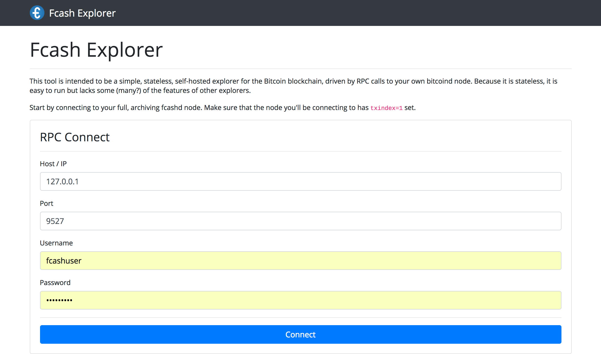
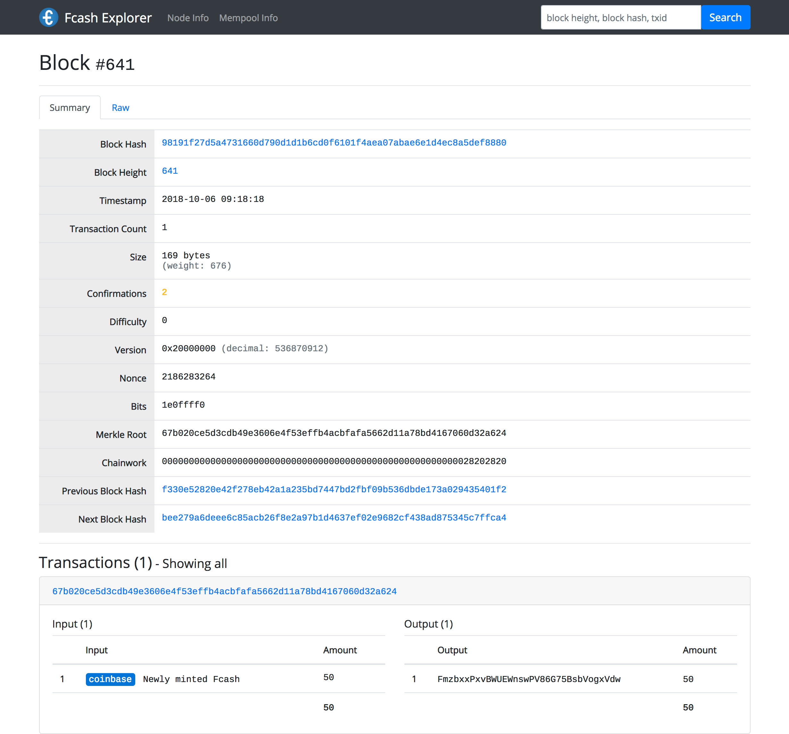
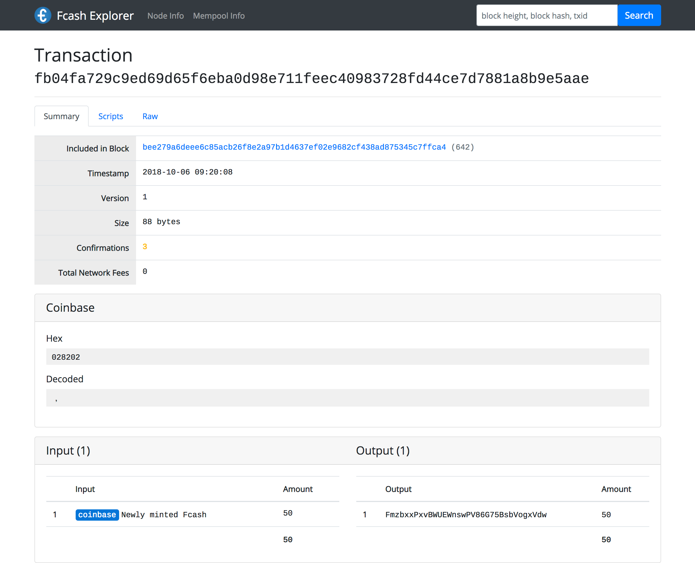
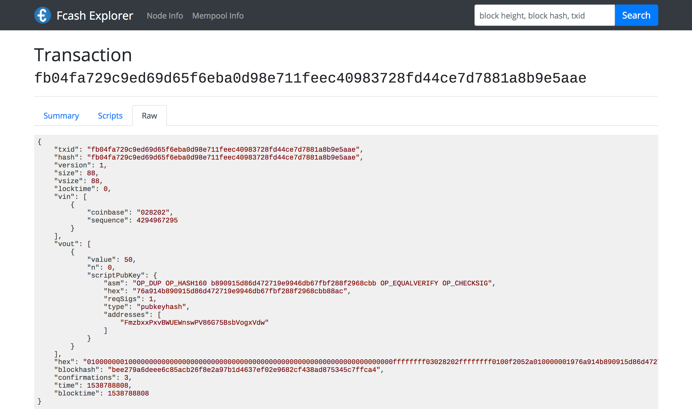
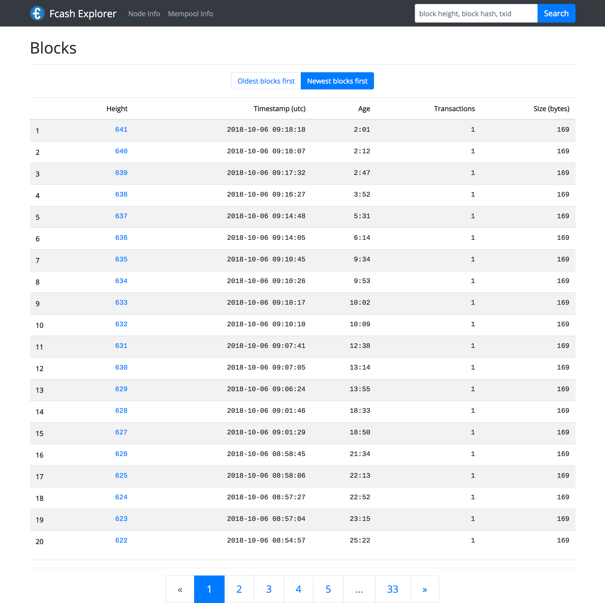

#  Fcash Explorer

Simple, stateless Fcash coin blockchain explorer, via RPC. Built with Node.js, express, bootstrap-v4.

This tool is intended to be a simple, stateless, self-hosted explorer for the Fcash coin blockchain, driven by RPC calls to your own fcashd node. This tool is easy to run but lacks features compared to full-fledged (stateful) explorers.

I built this tool because I wanted to use it myself. Whatever reasons one might have for running a full node (trustlessness, technical curiosity, etc) it's helpful to appreciate the "fullness" of a node.

# Features

* List of recent blocks
* Browse blocks by height, in ascending or descending order
* View block details
* View transaction details, with navigation backward via spent outputs
* View raw JSON output used to generate most pages
* Mempool/unconfirmed transaction counts by fee (sat/B)

# Getting started

## Prerequisites

1. Install and run a full, archiving node - [instructions](https://www.fcash.cash/en/full-node). Ensure that your node has full transaction indexing enabled (`txindex=1`) and the RPC server enabled (`server=1`).
2. Synchronize your node with the Fcash network.

## Instructions

1. Clone this repo
2. `npm install` to install all required dependencies
3. Optional: Uncomment the "fcashd" section in [env.js](app/env.js) to automatically connect to the target node.
4. `npm start` to start the local server
5. Navigate to http://127.0.0.1:3002/
6. Connect using the RPC credentials for your target Fcash node (if you didn't edit [env.js](app/env.js) in Step 3)

# Screenshots

### Connect via RPC
# 

### Homepage (list of recent blocks)
# 

### Block Details
# 

### Transaction Details
# 

### Transaction, Raw JSON
# 

### List of Blocks by height (in ascending order)
# 
